# REDWINE ANALYSIS
MAHALAKSHMI  


### Loading the Dataset

Loading the dataset and observing the basic structure ,column names to get a basic understanding of the dataset.The dataset chosen for exploratory data analysis wineQualityReds.csv.

It has 1599 wines listed with 11 attributes.The attribute names,structure of the data base is as below


```
##  [1] "X"                    "fixed.acidity"        "volatile.acidity"    
##  [4] "citric.acid"          "residual.sugar"       "chlorides"           
##  [7] "free.sulfur.dioxide"  "total.sulfur.dioxide" "density"             
## [10] "pH"                   "sulphates"            "alcohol"             
## [13] "quality"
```

```
## 'data.frame':	1599 obs. of  13 variables:
##  $ X                   : int  1 2 3 4 5 6 7 8 9 10 ...
##  $ fixed.acidity       : num  7.4 7.8 7.8 11.2 7.4 7.4 7.9 7.3 7.8 7.5 ...
##  $ volatile.acidity    : num  0.7 0.88 0.76 0.28 0.7 0.66 0.6 0.65 0.58 0.5 ...
##  $ citric.acid         : num  0 0 0.04 0.56 0 0 0.06 0 0.02 0.36 ...
##  $ residual.sugar      : num  1.9 2.6 2.3 1.9 1.9 1.8 1.6 1.2 2 6.1 ...
##  $ chlorides           : num  0.076 0.098 0.092 0.075 0.076 0.075 0.069 0.065 0.073 0.071 ...
##  $ free.sulfur.dioxide : num  11 25 15 17 11 13 15 15 9 17 ...
##  $ total.sulfur.dioxide: num  34 67 54 60 34 40 59 21 18 102 ...
##  $ density             : num  0.998 0.997 0.997 0.998 0.998 ...
##  $ pH                  : num  3.51 3.2 3.26 3.16 3.51 3.51 3.3 3.39 3.36 3.35 ...
##  $ sulphates           : num  0.56 0.68 0.65 0.58 0.56 0.56 0.46 0.47 0.57 0.8 ...
##  $ alcohol             : num  9.4 9.8 9.8 9.8 9.4 9.4 9.4 10 9.5 10.5 ...
##  $ quality             : int  5 5 5 6 5 5 5 7 7 5 ...
```

```
## [1] 1599
```

```
##  [1] "fixed.acidity"        "volatile.acidity"     "citric.acid"         
##  [4] "residual.sugar"       "chlorides"            "free.sulfur.dioxide" 
##  [7] "total.sulfur.dioxide" "density"              "pH"                  
## [10] "sulphates"            "alcohol"              "quality"
```

### OBJECTIVE 

The primary objective of the analysis is to find out how the quality of the wine varies w.r.t various properties

Response Variable - quality
Predictor Variables - acidity(2),citric acid,residual sugar,chlorides,sulphur dioxide(2),density,pH,sulphates,alcohol

All the Predictor Variables are continuous variables
Response variable quality is a categorical variable with factors 1 to 10 with 1 being the lowest  and 10 being the highest

OBSERVATION - there are no NA values for any of the variables


# UNIVARIATE PLOT SECTION

The individual columns(attributes) are analysed using various geometric graphs to get some idea on their distribution.
Checking the Distribution of the quality (response variable) of the listed wines.

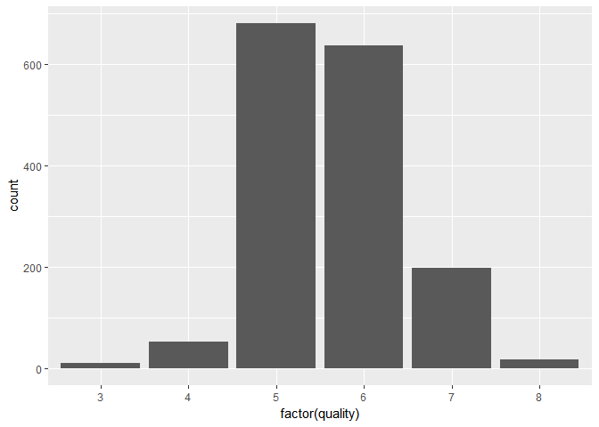<!-- -->

From the summary values and the plot it is observed that the values vary from 3-8 on the quality parameter.

### UNIVARIATE PLOTS FOR PREDICTOR VARIABLES

*citric.acid - from the table it can be seen that there are quite  lot of 0's and a entry with 1(probably an outlier)

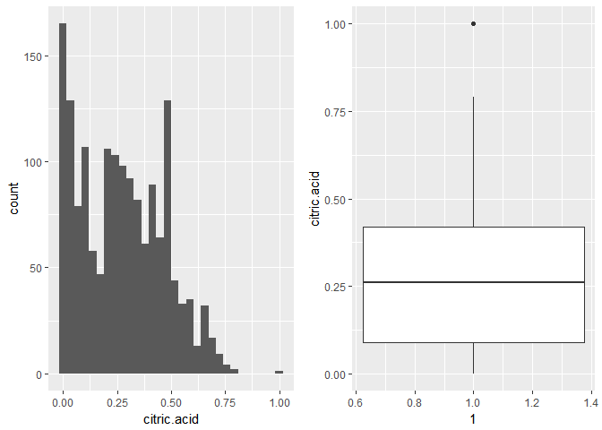<!-- -->

```
##    Min. 1st Qu.  Median    Mean 3rd Qu.    Max. 
##   0.000   0.090   0.260   0.271   0.420   1.000
```

*pHValue- shows a  near normal distribution


```
##    Min. 1st Qu.  Median    Mean 3rd Qu.    Max. 
##   2.740   3.210   3.310   3.311   3.400   4.010
```

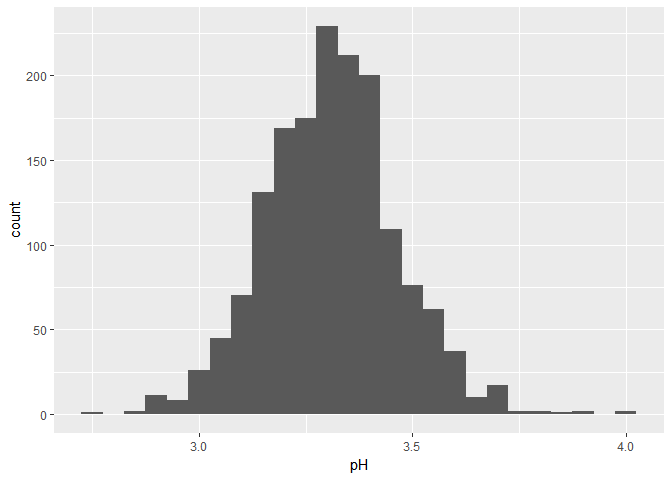<!-- -->

*Fixed Acidity

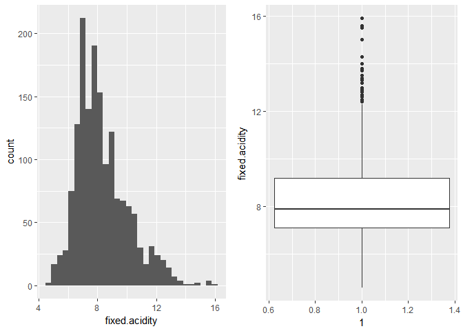<!-- -->

The above box plot shows a median of around 8 with some outlier data going upto 16 with a near normal distribution

*Volaile Acidity

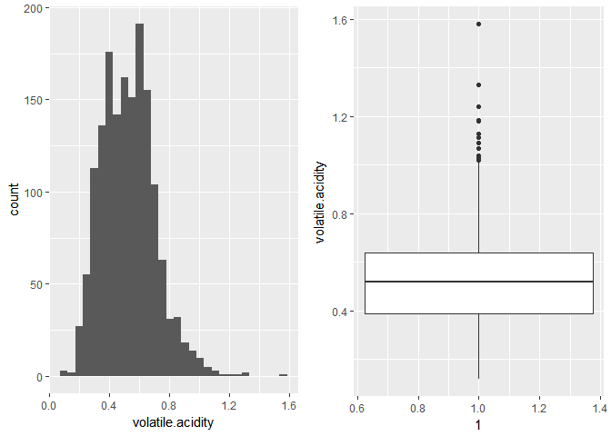<!-- -->

The above looks slightly positively skewed

*SULPHATES

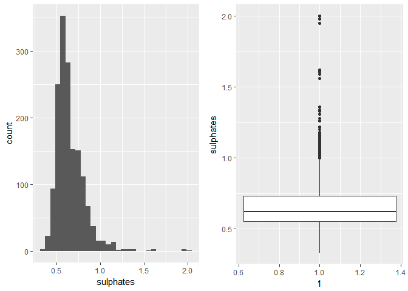<!-- -->

The above distribution looks much skewed hence some limiting /transformation can help in normalisation 

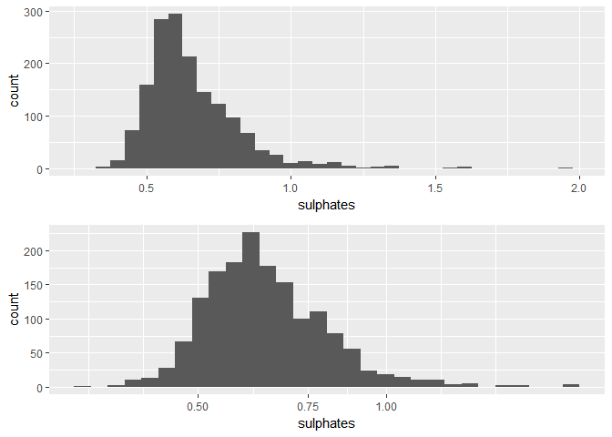<!-- -->

The logarithmic transformation to the sulphates renders a much normalised distribution.

*Alcohol

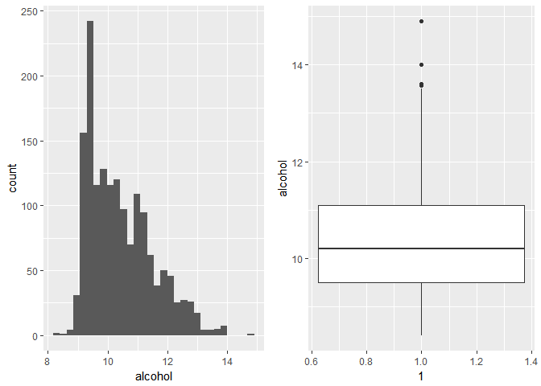<!-- -->

Alcohol looks like yet another case of a positively skewed distribution with some big peaks between 8-10

<!-- -->

The above plot shows a highly (+ve)skewed distribution of sugar.We can apply limits or apply log transformation to re-look the same

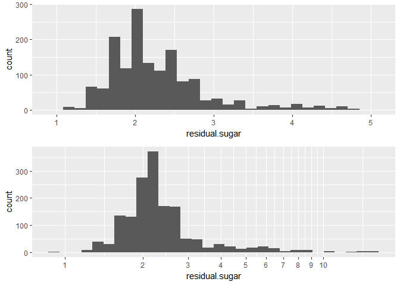<!-- -->

The skewness looked minimised after the transformation.

*Chlorides

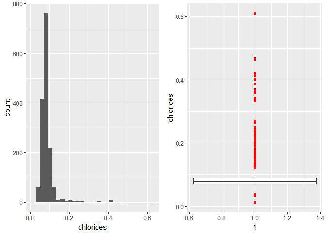<!-- -->

Applying some transformations to the skewed distribution

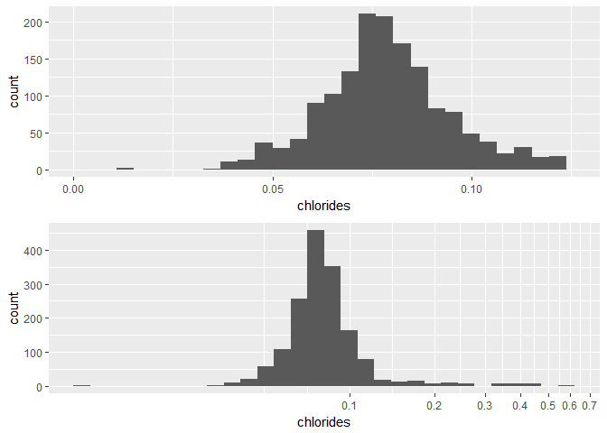<!-- -->

*Density

<!-- -->

The density looks very typical of a normal distribution

* Total Sulphur Dioxide

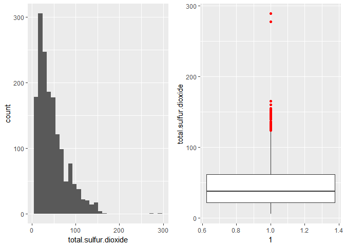<!-- -->

Applying transformations

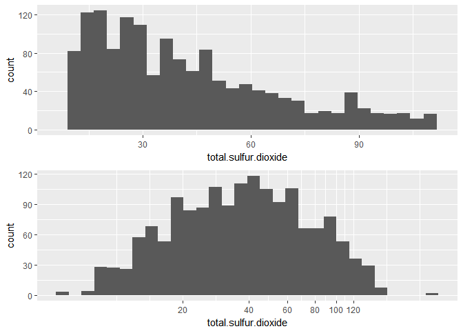<!-- -->

The log transformation works better in the above case

*Free SO2

<!-- -->

Applying transformation 

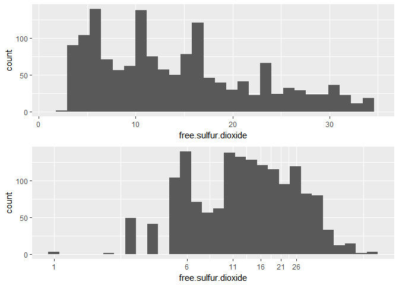<!-- -->


# UNIVARIATE ANALYSIS:

### Initial work on derived variables

From certain references we can calculate the total acidity based on the  sum of fixed acidity and volatile acidity
and also the Bound or fixed Sulphur dioxide from the difference of total and free Sulphur dioxide.
The usefulness of the derived variables will be explored further


### Transformation of certain variables

Some of the variables like Total SO2,Sulphates,Chlorides and residual sugar seem to have a skewed distribution.By setting the limits or by using transformations we can normalise the same as depicted above

Setting the limits and the tranformation seem to help in normalising the distribution to adjust the skewness and we can check below if the same results in a better f-statistic

# BIVARIATE PLOT SECTION

We can check the co relation between 2 variable using the Pearsons corelation and also thorugh graphs.

### CORELATION MATRIX TO CHECK THE INTERACTION AMONG THE ATTRIBUTES

Trying to plot a corelation matrix to arrive at the corelation among the attributes


```
##  [1] "fixed.acidity"        "volatile.acidity"     "citric.acid"         
##  [4] "residual.sugar"       "chlorides"            "free.sulfur.dioxide" 
##  [7] "total.sulfur.dioxide" "density"              "pH"                  
## [10] "sulphates"            "alcohol"              "quality"             
## [13] "total.acidity"        "bound.sulfur.dioxide"
```

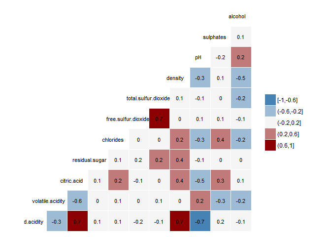<!-- -->

From the above graphs we can see strong positive relations between 
Citric.acid  and fixed acidity
free.sulfur.dioxide  and total.sulfur.dioxide
fixed.acidity and density

and inverse relation between
fixed.acidity  and pH 
alcohol and density
Citric.acid  and pH
Citric acid and Volatile acidity

Quality the response variable being a factor variable ,the corelation of the predictor variables with the response variable is not included in the above Corelation pyramid.However the same is explored in some of the below graph illustration

### ILLUSTRATIONS FOR  BIVARIATE -CORELATIONS

From the above we can see that the fixed acidity has a higher corelation  impact on the pH value.We can map it out in a graph and explore this further

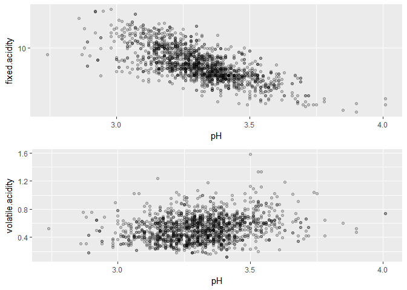<!-- -->

From the above graph we can see a might inverse corelation between the fixed.Acidity and the pH value which is again not very strong as seen in the r value of -.68 ( just above the 0.5 threshold).
However the Volatile.acidity does not show any  corelation with the pHvalue

### Checking the relationship between quality and SO2 values

Based on some of the studies the proportion of free.sulphur.dioxide/bound.sulfur.dioxide determines the quality of the wine.

Reference:http://www.morethanorganic.com/sulphur-in-the-bottle

<!-- -->

Crosschecking the inference from the above graph


```
## # A tibble: 6 × 3
##   quality    median count
##     <int>     <dbl> <int>
## 1       3 0.8448276    10
## 2       4 0.6428571    53
## 3       5 0.4791667   681
## 4       6 0.6767857   638
## 5       7 0.8181818   199
## 6       8 0.6189516    18
```
It can be observed from the above result and the box plots that the propotion of free.Sulfur.dioxide has not impacted the quality rating of the experts


<!-- -->

```
## 
##   3   4   5   6   7   8 
##  10  53 681 638 199  18
```

If we cut the outliers and consider only the middle 75% of the readings of quality
there seems to be a significant corelation between the SO2 content and quality rating

Plotting against the subsets

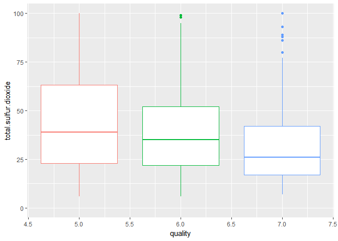<!-- -->

The subset shows a inverse relation between SO2 and Quality.


***OBSERVATION -

Based on the various wine resources the sulphates/sulphites value of a wine is the total SO2 value of the wine.However for this data set there exists a separate variable sulphates which is on the basis of pottasium sulphate content.However this can release SO2 gas.
The sulphates(Potassium metabisulphate) attribute is present in the form of gm/dm^3.Hence converting it to mg/dm3 to check if it has any significant impact on the quality when combined with the total.sulphur.dioxide

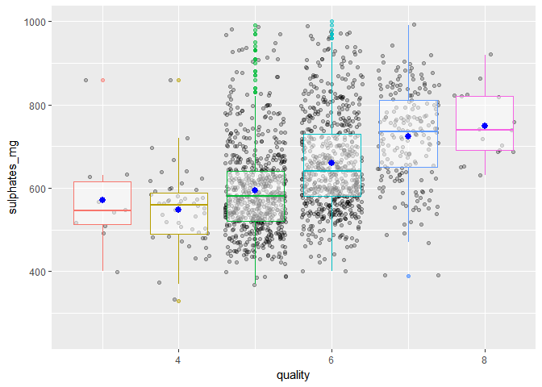<!-- -->

Looks like a positive co-relation between sulphates and quality.

### Checking the corelation between Alcohol level and quality

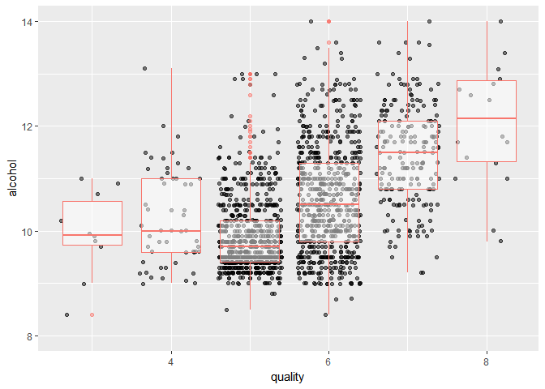<!-- -->

As per the above it is evident that there exists a positive corelation between the alcohol value and quality which is also confirmed by the pearson's r value of 0.476(near about 0.5)

### pH and Quality in a wine

As per expert research good quality red wines are normally within a pH range of 3.4
Here Iam trying to bucket the pH range into 2 levels to see if we can observe any significant relation


```
##    Min. 1st Qu.  Median    Mean 3rd Qu.    Max. 
##   2.740   3.210   3.310   3.311   3.400   4.010
```

```
## 
##  (2.7,3.4] (3.4,4.01] 
##       1212        387
```

```
## # A tibble: 6 × 4
##   quality lowpH highpH Proportion
##     <int> <int>  <int>      <dbl>
## 1       3     6      4       0.40
## 2       4    33     20       0.38
## 3       5   520    161       0.24
## 4       6   476    162       0.25
## 5       7   163     36       0.18
## 6       8    14      4       0.22
```

It can be seen from the above table that there exits  a marginal difference in the Proportion of highPH wines in each quality group with the lower rated wines having a slightly higher proportion of highpH wines as against the top rates ones.
This also verifies the fact that wines with a pH under 3.4 are supposed to be  of good quality 

### Relation between Fixed acidity and density

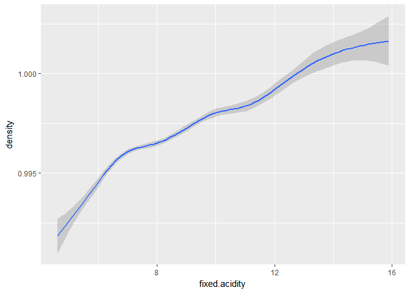<!-- -->

There seems to be a positive corelation between density and acidity.

### Density and Alcohol content

<!-- -->

Above we can notice the inverse relation between the alcohol content  and the density

### Citric Acid and Acidity

Since the citric acid is part of acidity we can check if there exists a direct corelation between the two

<!-- -->

The above shows a positive corelation between citric acid and fixed acidity.

# BI-VARIATE ANALYSIS

Some of the strongest relationships explored in the above section are
*CitricAcid and Fixed acidity
*pH and Acidity
*Quality and SO2
*Alcohol and density
*Fixed acidity and density
*Alcohol and Quality


However there were certain instances like the proportion of Free So2 versus quality which yielded no observable clear corelations.
There is a very strong Co-realtion between Free So2 and Total So2 since the free component is a part of the total component itself.


# MULTIVARIATE PLOT SECTION

From the above analysis we can see that there exists a relation between citric acid value and fixed acidity and the same is analysed with quality

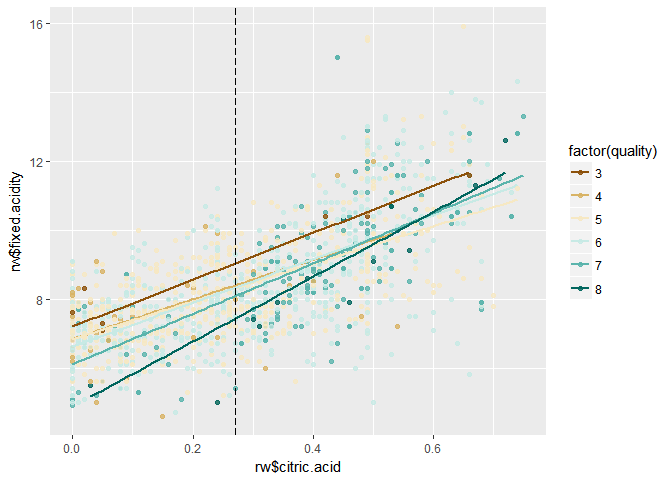<!-- -->


This shows that as the citric acid content increases there is a percieved better quality in the wine.
Also the slight increasing trend show the positive corealtion between citric acid and fixed acidity


```
## # A tibble: 6 × 3
##   quality Median count
##     <int>  <dbl> <int>
## 1       3  0.035    10
## 2       4  0.090    53
## 3       5  0.230   681
## 4       6  0.260   638
## 5       7  0.400   199
## 6       8  0.420    18
```
The observation from the graph is again reinstated showing a better perceived qualtiy with a positive corelation with citric acid

### EXAMININING THE ACIDITY ,  QUALITY AND DENSITY

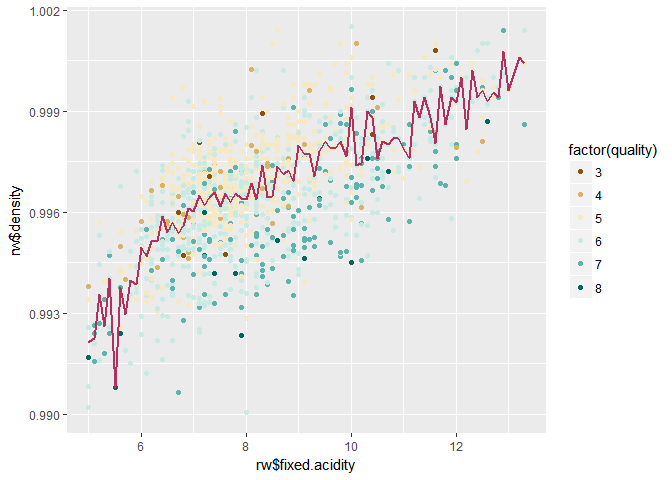<!-- -->


Inference:
Fixed acidity has a positive coreltion with the density but we can observe that the higher quality wines have a lesser density with more blue dots below the median line and the brownish dots above

### Checking the realtionship between density and quality using tables


```
## # A tibble: 6 × 3
##   quality Median_density Count
##     <int>          <dbl> <int>
## 1       3       0.997565    10
## 2       4       0.996500    53
## 3       5       0.997000   681
## 4       6       0.996560   638
## 5       7       0.995770   199
## 6       8       0.994940    18
```
If we look at the same using the mean function from the tables, the relationship is not so evident may be because the median and the mean are taken over larged grouped samples and the nuances are evened out.


### Checking relation between alcohol Density and quality

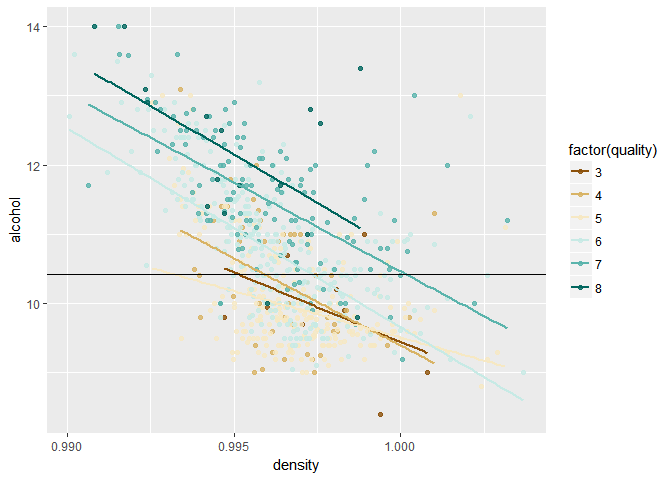<!-- -->

The above graph shows the inverse corelation between alcohol and density and also the positive corelation between alcohol content and quality With higher quality wines occupying the top of the mean line.

## BUILDING  LINEAR MODEL

Using the lm command to fit a linear model to the data


```
## 
## Call:
## lm(formula = quality ~ fixed.acidity + volatile.acidity + citric.acid + 
##     residual.sugar + chlorides + free.sulfur.dioxide + total.sulfur.dioxide + 
##     density + pH + sulphates + alcohol, data = rw_col_subset)
## 
## Residuals:
##      Min       1Q   Median       3Q      Max 
## -2.68911 -0.36652 -0.04699  0.45202  2.02498 
## 
## Coefficients:
##                        Estimate Std. Error t value Pr(>|t|)    
## (Intercept)           2.197e+01  2.119e+01   1.036   0.3002    
## fixed.acidity         2.499e-02  2.595e-02   0.963   0.3357    
## volatile.acidity     -1.084e+00  1.211e-01  -8.948  < 2e-16 ***
## citric.acid          -1.826e-01  1.472e-01  -1.240   0.2150    
## residual.sugar        1.633e-02  1.500e-02   1.089   0.2765    
## chlorides            -1.874e+00  4.193e-01  -4.470 8.37e-06 ***
## free.sulfur.dioxide   4.361e-03  2.171e-03   2.009   0.0447 *  
## total.sulfur.dioxide -3.265e-03  7.287e-04  -4.480 8.00e-06 ***
## density              -1.788e+01  2.163e+01  -0.827   0.4086    
## pH                   -4.137e-01  1.916e-01  -2.159   0.0310 *  
## sulphates             9.163e-01  1.143e-01   8.014 2.13e-15 ***
## alcohol               2.762e-01  2.648e-02  10.429  < 2e-16 ***
## ---
## Signif. codes:  0 '***' 0.001 '**' 0.01 '*' 0.05 '.' 0.1 ' ' 1
## 
## Residual standard error: 0.648 on 1587 degrees of freedom
## Multiple R-squared:  0.3606,	Adjusted R-squared:  0.3561 
## F-statistic: 81.35 on 11 and 1587 DF,  p-value: < 2.2e-16
```

```
## 
## Call:
## lm(formula = quality ~ volatile.acidity + citric.acid + chlorides + 
##     log(total.sulfur.dioxide) + pH + log(sulphates) + alcohol, 
##     data = rw_col_subset)
## 
## Residuals:
##      Min       1Q   Median       3Q      Max 
## -2.61021 -0.36567 -0.04557  0.45357  1.92473 
## 
## Coefficients:
##                           Estimate Std. Error t value Pr(>|t|)    
## (Intercept)                5.94891    0.47107  12.628  < 2e-16 ***
## volatile.acidity          -1.08252    0.11400  -9.496  < 2e-16 ***
## citric.acid               -0.24881    0.12012  -2.071 0.038496 *  
## chlorides                 -1.93690    0.39301  -4.928 9.15e-07 ***
## log(total.sulfur.dioxide) -0.08081    0.02367  -3.414 0.000657 ***
## pH                        -0.57006    0.13224  -4.311 1.73e-05 ***
## log(sulphates)             0.81929    0.08281   9.893  < 2e-16 ***
## alcohol                    0.29153    0.01717  16.979  < 2e-16 ***
## ---
## Signif. codes:  0 '***' 0.001 '**' 0.01 '*' 0.05 '.' 0.1 ' ' 1
## 
## Residual standard error: 0.6443 on 1591 degrees of freedom
## Multiple R-squared:  0.3662,	Adjusted R-squared:  0.3634 
## F-statistic: 131.3 on 7 and 1591 DF,  p-value: < 2.2e-16
```

## TEST AND TRAINING DATA

The Training set :Test Set has been split at 90:10 since the dataset is relatively small


```
## 
## Call:
## lm(formula = quality ~ volatile.acidity + citric.acid + chlorides + 
##     log(total.sulfur.dioxide) + pH + log(sulphates) + alcohol, 
##     data = rw_train)
## 
## Residuals:
##      Min       1Q   Median       3Q      Max 
## -2.62758 -0.37480 -0.05313  0.45210  1.95541 
## 
## Coefficients:
##                           Estimate Std. Error t value Pr(>|t|)    
## (Intercept)                5.59454    0.48692  11.490  < 2e-16 ***
## volatile.acidity          -1.04856    0.11753  -8.921  < 2e-16 ***
## citric.acid               -0.19149    0.12477  -1.535  0.12506    
## chlorides                 -1.86409    0.39820  -4.681 3.12e-06 ***
## log(total.sulfur.dioxide) -0.10660    0.02452  -4.348 1.47e-05 ***
## pH                        -0.42949    0.13774  -3.118  0.00186 ** 
## log(sulphates)             0.79384    0.08493   9.346  < 2e-16 ***
## alcohol                    0.28578    0.01767  16.173  < 2e-16 ***
## ---
## Signif. codes:  0 '***' 0.001 '**' 0.01 '*' 0.05 '.' 0.1 ' ' 1
## 
## Residual standard error: 0.6389 on 1432 degrees of freedom
## Multiple R-squared:  0.3721,	Adjusted R-squared:  0.369 
## F-statistic: 121.2 on 7 and 1432 DF,  p-value: < 2.2e-16
```
## PLOTTING THE RESIDUALS

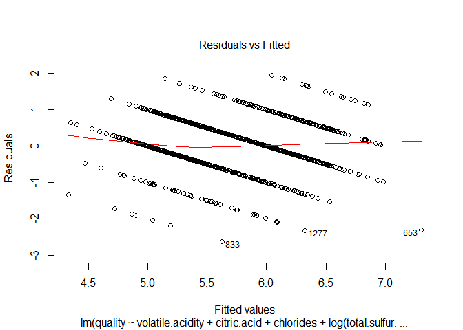<!-- --><!-- -->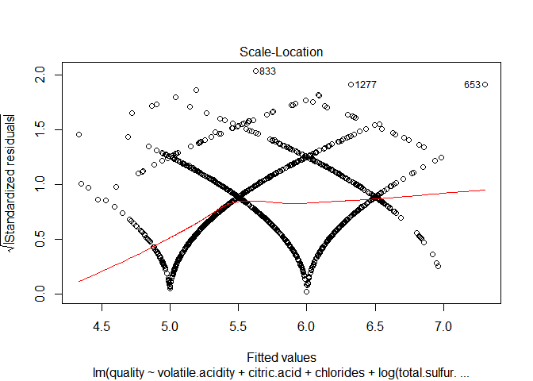<!-- --><!-- -->


From the plot 2 we can see that the observation lie around the 45 degree line and hence we can assume that the normality holds true in this case.


## PREDICTION using test data


```
## [1] "Estimator Output: 5"
```

```
## [1] "Actual Output: 5"
```

# MULTI-VARIATE ANALYSIS

 The analysis are inferences from each of the plot segment is mentioned under the plot.Also a Linear model has been built based on the data provided.
There have been really surprising corelations that can be observed from the plots and from the significance indicated in the model.The density,residula sugar  and fixed acidity do not seem to play an important role in determinig the quality however the exploratory data did show some relation

The model was initially built using all the variables and was further tuned to consider only the significant variables.
Limitations:The training :test ratio for building the model was 90%:10%  since the number of data points were limited.Hence there is a possibility of overfitting in the data

# FINAL PLOTS AND SUMMARY

Below are some of the final plots chosen which provide significant relationship among the variables.

### Plot One

SO2 and Quality

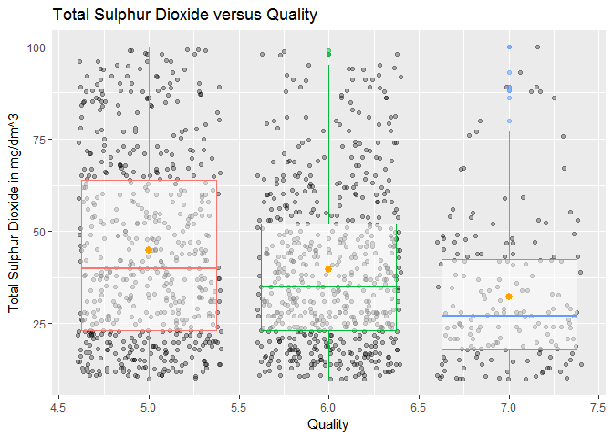<!-- -->

### Description 1:

The above plot shows the clear realtion between Total SO2 Content(y axis) and Quality(X axis).The higher the SO2 content the lower is the rated quality.
So2 is used a  necessary preservative however at higher levels it affects the taste and emits a not so good smell bringing down the  quality

### Plot Two

Acidity and citric Acid and Quality

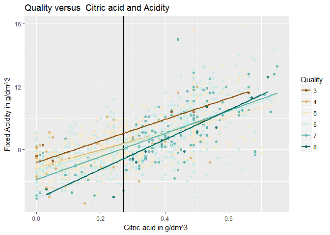<!-- -->

### Description 2:

Citric acid(X-axis) has a positive corelation with fixed acidity(y-axis) since it is a part of acidity value.
Just a casual observation will lead to make us believe that the better quality wines have a higher fixed acidity ,but this is mostly because of a higher citric acid presence with most of the high rated wines having a citric acid content of over 0.27 


### Plot 3

Alcohol -Density-Quality

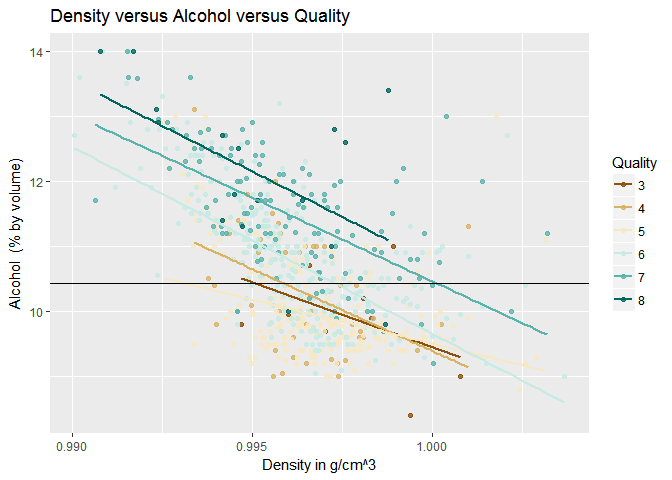<!-- -->


### Description 3:

The above plot shows the realtionship between alcohol(y axis) ,density(x axix) and quality(3rd dimension in coloured points)
We can  see a inverse relation between alcohol and density and also a positive corelation between higher quality and higher alcohol content can be observed which indicates that most of the highly rated alcohols had a higher alcohol content.

# REFLECTION

The Data set was fairly small with a limited set of attributes.
The dataset is quite clean which was easy in getting started with the analysis.

Surprise points:
There were some variables(citric acid and acidity) for which the  corelation number did not reveal much but plotting them in a graph could bring in the relationship.

There were some variables(acidity/density) which seemed to have a relationship to the quality but were considered insignificant in the linear model

Some struggles/Limitations:
-The data set was fairly small and also the samples for quality rating of 3 and 8 were too less so the presence in the point graphs could not be felt to make appropriate conclusions and more dependency was on quality grade of 4-7 which is mostly hovering around the mean quality.

- On the multivariate plots,plotting the variable was ok but deriving meaningful inference was a bit difficult

- Also felt the lack of domain knowledge/chemistry to my disadvantage

Future Possible explorations:
New features can be formed based on the realtionship and interaction between the variables like(citric acid and acidity) or pH and acidity or sulpahtes and SO2 -how each of the variable is dependent upon the other and the rate a which it is affected.
This would in turn help fine tuning the linear model for a better fit to the data.


